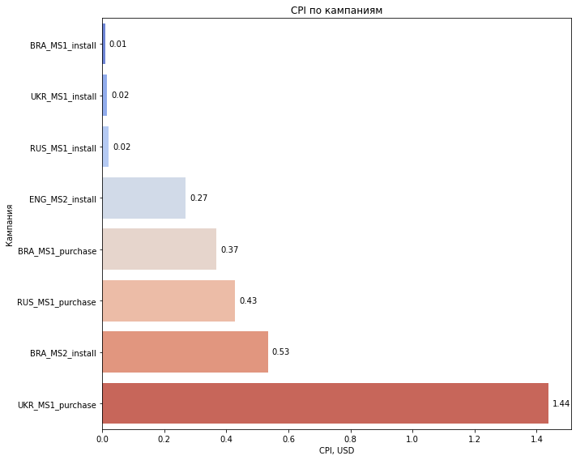

# Анализ рекламных кампаний
Цель анализа - определить оптимальный срок окупаемости, а также слабые места рекламных кампаний игры.
 
## Задачи
1. Определить оптимальный срок оценки окупаемости рекламных кампаний;
2. Оценить успешность каждой кампании;
3. Рассчитать накопительный APRU для 7, 14 и 30 дня жизни пользователей;
4. Рассчитать Cost Per Install для кампаний;

## Инструменты

### Python

- Pandas 

> Создание датафреймов и расчет метрик

- Matplotlib / Seaborn 

> Построение графиков и диаграмм 

## Исходные данные 

Таблицы, выгруженные из БД:

- payments.csv 
> Транзакции за 2021 год
- persents.csv
> Комиссии платежных систем
- registrations.csv
> Регистрации за январь 2021 года
- budget_jan_2021 
> Отчет о результатах кампаний в январе 2021 года

# 1.  Определение оптимального срока оценки окупаемости рекламных кампаний.

## Коэффициент окупаемости

Окупаемость рекламной кампании - важнейший, хотя и не единственный показатель ее успешности. 

При оценке окупаемости средств, затраченных на рекламную кампанию, остро стоит проблема определения времени, спустя которое можно начинать анализировать результаты. Выбор слишком раннего срока оценки опасен тем, что мы можем не учесть последующее увеличение прибыли и прийти к ложным выводам. Слишком большой срок оценки может привести большим расходам на бесперспективные рекламные кампании и не позволяет своевременно реагировать на изменения на рынке. 

Иначе говоря, нам нужно проанализировать рост окупаемости каждой рекламной кампании и найти момент времени, спустя который изменения становятся незначительными. 

Заранее определимся с тем, как будем считать окупаемость:

ROMI _(Return on Marketing Investment)_ - коэффициент, отображающий окупаемость маркетинговой кампании. 

ROMI = 100%, в частности, является “точкой безубыточности” - при этом значении коэффициента все потраченные на рекламную кампанию средства окупились. 

Разумно будет разделить данные по типам рекламных кампаний - одни направлены на повышение количества установок, другие - количества покупок.

## Кампании типа “purchase”

Построим график изменения ROMI за 2021 год для рекламных кампаний типа “purchase”:

Сразу стоит заметить - значения даты начинаются не с 1 января 2021 года. Это связано с тем, что для устранения выбросов используется медианное сглаживание.

Проведем визуальный анализ графика. С середины июля, т.е. спустя 6,5 месяцев с начала анализируемого нами периода, значения ROMI стабилизируются. Это также отражается на графике производной нашего временного ряда - скорость роста функции в этот момент опускается практически до нуля:

## Кампании типа “install”

Проанализируем кампании типа “install”:

В данном случае очень сложно найти какую-либо закономерность в ходе окупаемости рекламных кампаний на основе предоставленных данных. Окупаемость рекламных кампаний на платформе MS2 практически не растет с самого начала, и по ним нельзя сделать никаких выводов. Остаются три кампании, графики роста окупаемости которых ведут себя совершенно по-разному. Линия UKR_MS1 становится горизонтальной гораздо раньше, чем RUS_MS1, а линия BRA_MS1 стабильно растет. 

На графике приведенном ниже, наблюдается спад значений производных для RUS_MS1 и BRA_MS1 приблизительно через 7 месяцев с начала анализируемого нами периода.

При наличии данных о регистрациях за больший период времени, можно было бы также разбить пользователей на когорты по месяцам или кварталам, чтобы учесть влияние сезонности спроса и найти закономерности. 

## Выводы

Таким образом, для кампаний типа “purchase” оптимальный срок оценки составляет **6,5 месяцев**, а для типа “install” - **7 месяцев**.

На самом деле, не совсем корректно определять оптимальный срок окупаемости рекламной кампании, основываясь на данных лишь за один месяц ее проведения. Лучшим решением, на мой взгляд, является создание предиктивной математической модели, которая будет предсказывать будущие значения  ROMI  на более ранних этапах, основываясь на данных за предыдущие периоды. 

# 2.  Анализ рекламных кампаний

## Наиболее успешные рекламные кампании

Мы уже разделили наши кампании по типу на две группы - “install” и “purchase”. Теперь найдем наиболее успешную РК для каждой группы на момент оценки окупаемости.

### 1. Тип “purchase”
Выделим основные показатели, определяющие успешность рекламной кампании, оптимизированной под увеличение количества покупок:

* CAC (Customer Acquisition Cost) - стоимость привлечения одного клиента.
* CR (Conversion Rate) - конверсия из установки в покупку.
* Среднее количество покупок у клиента.
* ARPPU - (Average Revenue Per Paying User) - средняя прибыль от платящего пользователя.
* ROMI _(Return on Marketing Investment) _- окупаемость маркетинговой кампании.

Момент оценки окупаемости - 15 июля 2021 года. 

Построим сводную таблицу с метриками для каждой из кампаний, раскрасив значения в виде “тепловой карты” :

Можно сделать вывод, что самой успешной рекламной кампанией является **UKR_MS1_purchase**, поскольку пользователи, пришедшие с нее, лучше всего конвертируются в покупателей, и при этом являются наиболее платящими из всех (основываясь на ARPPU) и совершают больше всего покупок (avg_purch). 

### 2. Тип “install” 

Выделим основные показатели, определяющие успешность рекламной кампании, оптимизированной под увеличение количества установок:

* Количество установок.
* CPI (Cost per Install) - стоимость установки. 
* ARPU - (Average Revenue Per User) - средняя прибыль от пользователя.
* ROMI _(Return on Marketing Investment) _- окупаемость маркетинговой кампании.

Момент оценки окупаемости - 1 августа 2021 года. 

Построим соответствующую сводную таблицу, как для “purchase” кампаний :

Так как эти кампании направлены в первую очередь на увеличение количества установок, успешнее всего выглядит кампания **BRA_MS1_install**, поскольку с нее мы получили много дешевых установок и хорошую окупаемость. 

Стоит также обратить внимание на RUS_MS1_install. Она тоже хорошо окупается, и мы получили с нее много новых пользователей, покупающих в 1,5 раза активнее тех, что пришли с BRA_MS1_instal (СR).  Если мы поработаем над снижением стоимости установки (CPI) для этой кампании, т.е. изменим содержание рекламы, мы можем привлечь больше платящих пользователей. 

## Наиболее успешный тип рекламных кампаний

Успешность кампании стоит оценивать по тому, насколько хорошо она решает поставленную перед ней задачу. 

Цель кампаний типа** “purchase”**, очевидно - увеличить число покупок и принести прибыль. К сожалению, все три кампании этого типа окупаются слабо, хотя и приносят нам много ценных платящих пользователей. Стоит поработать над снижением стоимости привлечения клиента (CAC) - сделать рекламу более привлекательной для пользователей.

Цель кампаний **“install”** - расширить нашу базу игроков. Кампании на платформе MS1 отлично справились с этой задачей, поэтому этот тип РК оказался **наиболее успешным**. Хотя от кампаний этого типа не ожидается высокая окупаемость или ARPU, несколько из них принесли нам хорошую выручку.

## Наиболее успешная рекламная сеть

Проанализируем данные из сводной таблицы по кампаниям типа “install”, а также график изменения ROMI для них. Без сомнения, наиболее успешной рекламной сетью оказалась **платформа MS1.** 

Хотя пользователи, привлеченные по каналу MS2, намного лучше конвертируются в платящих и приносят больше прибыли, их привлечение обходится нам очень дорого и не окупается. 

# 3.  Расчет накопительного ARPU

Визуализируем на графике значения накопительного ARPU для каждой РК на 7, 14, 30 день жизни пользователей:

# 4.  Расчет фактического CPI  для рекламных кампаний

Визуализируем на графике фактические значения Cost per Install для каждой РК:

